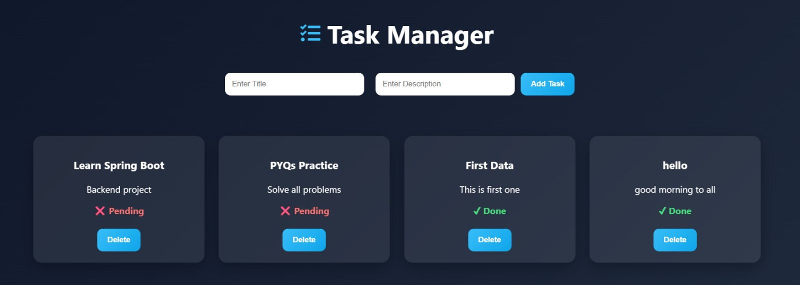

# 🚀 Task Manager (Full Stack)

A full-stack Task Manager application built using **Spring Boot + MySQL (Backend)** and **React (Frontend)**.
It allows users to create, update, delete, and manage tasks with a clean and responsive UI.

---

## ✨ Features

* ✅ Add new tasks
* 📝 Update task status (Pending → Done)
* ❌ Delete tasks
* 📋 View all tasks
* 🔄 Real-time UI updates

---

## 🛠️ Tech Stack

### 🔹 Backend

* Spring Boot
* Spring Data JPA
* MySQL
* REST APIs

### 🔹 Frontend

* React.js
* HTML, CSS
* Fetch API

### 🔹 Tools

* Postman (API Testing)
* Git & GitHub

---

## 📂 Project Structure

```
backend/
 ├── backend (Spring Boot App)
 └── todo-frontend (React App)
```

---

## ⚙️ How to Run Locally

### 🔸 Backend

```bash
cd backend/backend
mvnw spring-boot:run
```

👉 Runs on: http://localhost:8080

---

### 🔸 Frontend

```bash
cd todo-frontend
npm install
npm start
```

👉 Runs on: http://localhost:3000

---

## 🔗 API Endpoints

| Method | Endpoint    | Description   |
| ------ | ----------- | ------------- |
| GET    | /tasks      | Get all tasks |
| POST   | /tasks      | Create task   |
| PUT    | /tasks/{id} | Update task   |
| DELETE | /tasks/{id} | Delete task   |

---

## 📸 Screenshots



---

## 👨‍💻 Author

**Prince Kumar**
GitHub: https://github.com/codder-prince

---

## ⭐ If you like this project

Give it a ⭐ on GitHub!
